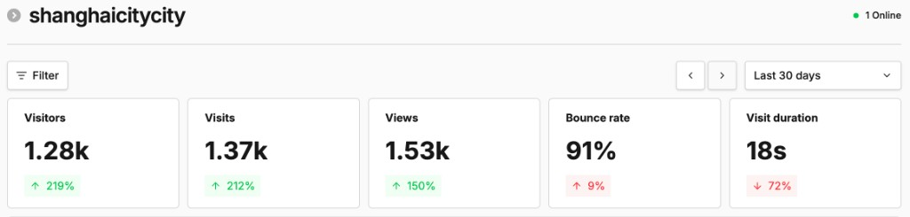
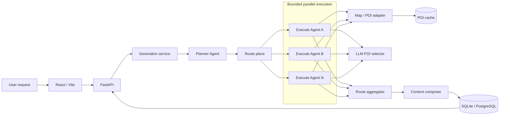
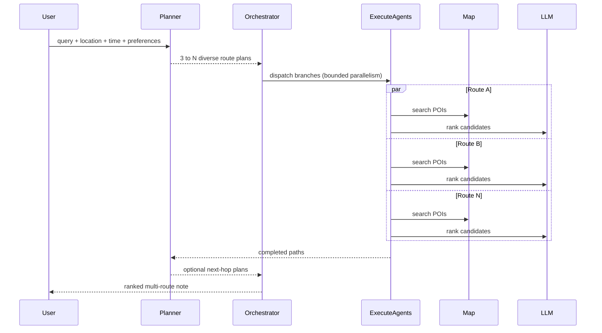

<p align="center">
  
</p>

<h1 align="center">CityCity Agent</h1>

<p align="center"><strong>An AI agent for city activity planning: grounded, parallel, multi-route ideas for what to do next.<br />Also shipped as an agent skill, so Cursor, Claude Code, and Codex can plan city routes for you.</strong></p>

<p align="center">
  <a href="README_CN.md">中文文档</a> ·
  <a href="https://shanghaicitycity-web.havenai.online/">Live Demo</a> ·
  <a href="https://github.com/lianyixin/citycity-agent">GitHub</a>
</p>

<p align="center">
  <a href="https://shanghaicitycity-web.havenai.online/"></a>
  <a href="https://shanghaicitycity-web.havenai.online/"></a>
  <a href="https://www.xiaohongshu.com/user/profile/62aa83ef000000001b02b574"></a>
  <a href="LICENSE"></a>
</p>

**[上海 City 不 City](https://shanghaicitycity-web.havenai.online/)** is an **AI-driven Shanghai citywalk route discovery platform**. This repository is the open-source agent behind it: given a request such as “What can I do around Shanghai Changning tonight?”, CityCity Agent returns **several grounded city-play routes**. A Planner Agent creates diverse branches; bounded parallel Execute Agents search, evaluate, and expand those branches against real POI data.

## 📊 Traction

As of **15 August 2026**, the live Shanghai product already has real users and real content:

| Signal | Snapshot |
| --- | --- |
| **Monthly visitors** | **~1.3k MAU** (1.28k unique visitors in the last 30 days) |
| **Social proof** | Xiaohongshu account [上海 City 不 City](https://www.xiaohongshu.com/user/profile/62aa83ef000000001b02b574) has **400+ followers**, publishing AI-generated city-play notes |

<p align="center">
  
</p>

<p align="center"><sub>Umami snapshot for the live site, last 30 days, captured before 15 August 2026.</sub></p>

## 🚀 What makes it different

> [!IMPORTANT]
> ### One request. Multiple grounded ways to play.
> - ⚡ **Explore before committing.** A Planner fans out diverse ideas, then bounded parallel Execute Agents develop multiple candidate routes at the same time.
> - 🏙️ **Designed for city life, not trip logistics.** The focus is a few hours to one day of citywalks, dates, family outings, food trips, photography, and nightlife—not hotels, flights, or multi-day transfers.
> - 📍 **Grounded and expandable.** Each branch searches real map POIs, selects suitable places, and can recursively add the next stop instead of stopping at generic advice.

| | Common one-shot itinerary flow | **CityCity Agent** |
| --- | --- | --- |
| **Output** | One answer to accept or regenerate | Multiple distinct routes to compare in one generation |
| **Scope** | Broad travel itinerary generation | City activity planning for the next few hours or one day |
| **Execution** | A single linear generation pass | Planner → parallel Execute Agents → POI grounding → route aggregation |

## 🎬 Live demo

**[Try Shanghai CityCity →](https://shanghaicitycity-web.havenai.online/)**

https://github.com/user-attachments/assets/692651f0-d87b-4a2e-b287-cab1bd7e0bad

**[▶ Download the HD product walkthrough](https://github.com/lianyixin/citycity-agent/releases/download/product-demo/product-demo.mp4)** · [Release page](https://github.com/lianyixin/citycity-agent/releases/tag/product-demo)

## 🎯 Background

Maps are good at answering “Where is this place?” and travel feeds are good at showing “Where did other people go?” Neither fully answers situational questions such as “What can two friends do around Shanghai Changning after work?” or “Plan a relaxed, photo-friendly Saturday afternoon.”

CityCity Agent extracts location, time, companions, budget, and preferences from natural language; proposes multiple activity directions; validates them against map POIs in parallel; and composes several routes that the user can choose from. The live product is Shanghai-focused, while the workflow is designed to extend to other cities and map providers.

## 💬 Try these queries

Results are usually better when a query includes where, when, who, and what kind of experience you want:

```text
What can two people do around Shanghai Changning tonight?

Starting from Jing'an Temple on Saturday afternoon, plan a relaxed walk with coffee and photo stops.

I have three hours after work near Xujiahui and a ¥200 budget. I want dinner and a night view.

What can I do with children in Pudong on a rainy day? Prefer indoor places that are close together.

Plan a quiet first date around Xintiandi with good photo spots.

I am staying near the Bund. Plan a morning city walk followed by a local Shanghai lunch.

How should I spend half a day around West Lake in Hangzhou without only visiting the busiest attractions?
```

> [!NOTE]
> **Keep the trip within one day for now.** CityCity Agent is currently best suited to a few hours, a half day, or a single day of city walks, dates, family activities, food trips, photography, and nightlife. Multi-day, multi-city, hotel, and long-distance transport planning are not yet optimized.

For cities supported by Amap, change the default city, coordinates, and API key. For regions outside Amap coverage, implement a Google Maps, Mapbox, or other map-provider adapter while reusing the Planner/Execute orchestration.

## ✨ What's included

- A runnable React/Vite discovery feed and AI planning interface
- FastAPI generation, progress logs, search, interactions, and ZIP export
- Planner Agent, Execute Agent, and multi-round route exploration
- Bounded parallel route execution built with `asyncio`
- Amap POI search, geocoding, and persistent response caching
- DeepSeek-powered planning, POI selection, and content composition
- SQLite local development and PostgreSQL production support
- Optional Logto auth, Umami analytics, Alipay subscriptions, and Jimeng image polishing
- Docker deployment, demo seed content, bilingual documentation, and backend tests

## 🧠 Engineering highlights

- **Parallel route exploration** — multiple itinerary branches run concurrently instead of one serial chain.
- **Planner / Execute separation** — the LLM plans intent; tool-backed execution grounds each step in real POIs.
- **Recursive route expansion** — successful branches can receive a next-step plan for multi-stop routes.
- **Bounded concurrency** — `asyncio.Semaphore` and `asyncio.gather` control parallelism and API pressure.
- **Partial-failure isolation** — one failed branch does not discard successful routes; all-branch failures still surface.
- **Structured output** — routes, steps, POIs, generation logs, and final social cards remain queryable.
- **Provider boundary** — map access is isolated behind `AmapTool`, making another provider adapter practical.
- **Full-stack reference** — React/Vite frontend, FastAPI backend, SQLAlchemy persistence, auth, analytics, payment, and optional image polishing.

## 🧩 Agent Skill: city play planning in your own agent

**An agent skill for grounded city activity planning: Planner fan-out · parallel Execute branches ·
real Amap POI verification · multiple comparable routes.**

The same Planner / Execute workflow that powers the live product is packaged as a standalone
[Agent Skill](skills/citycity-play-planner/SKILL.md). Once installed, your coding agent can answer
city activity questions directly: it extracts intent, fans out several distinct play directions,
verifies each stop against live Amap POI data in parallel, expands promising branches into
multi-stop routes, and returns several routes you can compare.

It follows the open `SKILL.md` format and works in Cursor, Claude Code, Codex, and other
compatible agents. It does not need CityCity's backend or DeepSeek; POI grounding calls the Amap
Web Service API through a bundled script, so it requires `AMAP_API_KEY` and currently covers
mainland China. Because an agent has no access to your device location, set a default city and
coordinates once, or the skill will ask where you are before planning.

### Install and use

The most direct way is to hand the repository link to your agent. In Cursor, Claude Code, Codex,
or another compatible agent, say:

```text
Install this skill for me: https://github.com/lianyixin/citycity-agent
It lives in skills/citycity-play-planner.
```

The agent will clone the repo and link the skill into your skills directory. Or install with the
skills CLI / manually:

```bash
npx skills add lianyixin/citycity-agent
```

```bash
git clone https://github.com/lianyixin/citycity-agent.git
cd citycity-agent

ln -s "$(pwd)/skills/citycity-play-planner" ~/.claude/skills/citycity-play-planner   # Claude Code
# or
ln -s "$(pwd)/skills/citycity-play-planner" ~/.codex/skills/citycity-play-planner    # Codex
# or
ln -s "$(pwd)/skills/citycity-play-planner" ~/.cursor/skills/citycity-play-planner   # Cursor
```

Set your Amap key so the skill can ground places. Unlike the web product, an agent cannot read
your device location, so also give it a home base — otherwise it has to ask where you are every
time:

```bash
export AMAP_API_KEY=your_server_side_amap_key

# Optional but recommended: your default city and starting point
export DEFAULT_CITY=上海
export DEFAULT_CITY_LAT=31.2304
export DEFAULT_CITY_LNG=121.4737
```

Restart the agent if it indexes skills only at session startup.

Then make requests like:

```text
上海长宁今晚有什么适合两个人玩的？

Use citycity-play-planner to plan a relaxed Saturday afternoon walk starting from Jing'an Temple, with coffee and photo stops.

雨天在浦东带孩子玩什么？希望室内为主，地点不要太分散。
```

The skill contains:

- [`SKILL.md`](skills/citycity-play-planner/SKILL.md) — trigger metadata and the seven-step planning workflow
- [`scripts/amap_poi.py`](skills/citycity-play-planner/scripts/amap_poi.py) — Amap POI search and geocoding, standard library only
- [`references/route-quality.md`](skills/citycity-play-planner/references/route-quality.md) — POI selection, filtering, deduplication, and diversity rules
- [`references/worked-example.md`](skills/citycity-play-planner/references/worked-example.md) — a full run from request to final routes

## 🏗️ Architecture



### Parallel agent workflow



The implementation uses `MAX_PARALLEL_ROUTES` (default `4`) to cap active route branches. `asyncio.gather(..., return_exceptions=True)` preserves successful branches when one branch fails, while propagating an error when every branch fails.

## 🧰 Tech stack

- **Frontend:** React, TypeScript, Vite
- **Backend:** Python, FastAPI, Pydantic
- **Agent orchestration:** async Planner Agent + bounded parallel Execute Agents
- **LLM:** DeepSeek (replaceable through the client boundary)
- **Maps:** Amap Web Service API with persistent response cache
- **Database:** SQLite for local development; PostgreSQL for production
- **Optional integrations:** Logto, Umami, Alipay, Volcengine Jimeng
- **Deployment:** Docker; the live demo is hosted with [Haven AI](https://havenai.cn/) and [EasyLaunch](https://easylaunch.aimos.cloud/)

## 🚀 Quick start

### Requirements

- Python 3.11+
- Node.js 20+
- An Amap Web Service API key
- A DeepSeek API key

### 1. Configure

```bash
git clone https://github.com/lianyixin/citycity-agent.git
cd citycity-agent
cp .env.example .env.development
```

Edit `.env.development` and set at least:

```dotenv
AMAP_API_KEY=your_server_side_amap_key
DEEPSEEK_API_KEY=your_deepseek_key
```

Never commit `.env.development`, `.env.production`, private keys, database URLs, or provider tokens. `.gitignore` already excludes them.

### 2. Start the backend

```bash
python -m venv .venv
source .venv/bin/activate
pip install -r backend/requirements.txt
PYTHONPATH=backend uvicorn app.main:app --app-dir backend --host 0.0.0.0 --port 8001 --reload
```

SQLite is used automatically when `DATABASE_URL` is empty.

### 3. Start the frontend

```bash
cd frontend
npm install
npm run dev
```

Open <http://localhost:5173>. Vite proxies `/api` to <http://localhost:8001>.

### 4. Optional seed content

```bash
PYTHONPATH=backend python scripts/import_seed.py
```

## 🌍 Run in another city

For cities supported by Amap:

```dotenv
DEFAULT_CITY=杭州
DEFAULT_CITY_LAT=30.2741
DEFAULT_CITY_LNG=120.1551
AMAP_API_KEY=your_amap_key
```

The request itself may also contain a target area and coordinates; those take precedence over defaults.

### International cities

An overseas deployment requires more than changing a key because map providers use different request and response schemas. Implement a provider adapter exposing the same capabilities as `AmapTool`:

```python
async def search_pois(query, location, city, radius, limit): ...
async def suggest_locations(query, location, city, limit): ...
```

Then wire it into `PlayDiscoveryWorkflow`. A Google Maps adapter would use a Google Maps API key while keeping the Planner/Execute parallel orchestration unchanged.

## ⚙️ Configuration

The safe template is documented in [`.env.example`](.env.example).

| Variable | Required | Purpose |
| --- | --- | --- |
| `AMAP_API_KEY` | Yes | Server-side Amap Web Service access |
| `DEEPSEEK_API_KEY` | Yes | Planning, selection, and content generation |
| `DEFAULT_CITY` | No | Fallback city; defaults to Shanghai |
| `DEFAULT_CITY_LAT/LNG` | No | Fallback center coordinates |
| `MAX_PARALLEL_ROUTES` | No | Maximum concurrent route branches |
| `DATABASE_URL` | No | PostgreSQL DSN; empty uses SQLite |
| `EXTRA_IMAGE_HOSTS` | No | Extra comma-separated public CDN hosts allowed for ZIP export |
| `LOGTO_*`, `VITE_LOGTO_*` | No | Authentication |
| `VITE_UMAMI_*` | No | Analytics (public browser configuration) |
| `ALIPAY_*` | No | Subscription payment |
| `JIMENG_*` | No | Optional image polishing |

Variables prefixed with `VITE_` are embedded in the browser bundle and must never contain secrets.

## 🔄 API and data flow

- `POST /api/generate` starts a generation request.
- The Planner Agent creates diverse root plans from intent and context.
- Execute Agent branches concurrently search POIs and use an LLM to select grounded candidates.
- Completed paths can be recursively expanded.
- Candidate routes are filtered, deduplicated, and composed into one multi-route note.
- SQLAlchemy persists requests, logs, methods, POIs, posts, and interactions.
- A map-response cache reduces duplicate API traffic.

This project does **not** include an automated daily publishing scheduler. Content is generated only from explicit API or user requests.

## ✅ Tests

```bash
PYTHONPATH=backend python -m pytest backend/tests -v
cd frontend && npm run build
```

## 🐳 Production and Docker

Build the frontend first, then build the image:

```bash
cd frontend && npm ci && npm run build && cd ..
docker build -t citycity-agent .
docker run --rm -p 8001:8000 --env-file .env.production citycity-agent
```

Keep `.env.production` outside Git and inject it through your deployment platform.

## 🔐 Security

- Keep API keys and other secrets in server-side environment variables, never in the frontend or in git.
- Copy [`.env.example`](.env.example) for local setup; real `.env.*` files are gitignored.
- `VITE_*` values are embedded in the browser bundle, so they must stay public-only.
- If a secret is accidentally committed, rotate it immediately—deleting the file from the latest commit is not enough.

Please report vulnerabilities according to [SECURITY.md](SECURITY.md).

## ⚠️ Current limitations

CityCity Agent is a working agent application and engineering reference, not yet a fully reliable general-purpose city planner.

### Agents and orchestration

- **Limited Planner reasoning:** planning is primarily prompt-driven and does not yet include explicit constraint solving, reflection, backtracking, or global route optimization.
- **Partial parallelism:** active Execute Agent branches run concurrently, but recursive Planner calls are still processed node by node. The workflow also runs inside one FastAPI process.
- **Fixed search budget:** rounds, branches, and path depth have fixed limits, which can under-explore complex requests or over-process simple ones.
- **Weak recovery model:** there is no distributed task queue, durable checkpoint, resume-from-node behavior, or cross-process orchestration.
- **LLM output fragility:** planning and composition depend on structured JSON from the model. Parsing and fallbacks help, but malformed or semantically drifting output remains possible.

### POI and route quality

- **Limited POI ranking signals:** selection mainly uses Amap candidates, rating, distance, image completeness, and LLM judgment. It lacks saves, review volume, recent popularity, queues, and personal preference signals.
- **Weak hotspot discovery:** a future version could use legally accessible and authorized engagement data—such as likes, saves, and discussion trends from lifestyle platforms—to identify genuinely popular POIs before building activities around them.
- **Approximate routing:** coordinates and straight-line distance help compare places, but walking, driving, and transit time are not yet used to solve visit order.
- **Stale availability risk:** a map result or LLM may select a temporarily closed or time-inappropriate POI. Real-time hours and multi-source verification are still missing.
- **Incomplete constraints:** weather, budget, accessibility, child/pet friendliness, queue time, and reservation requirements are not enforced as hard constraints.
- **Little personalization:** there is no long-term user profile, feedback learning, or group-preference negotiation.

### Content, images, and product experience

- **Inconsistent image quality:** images mostly come from map POI responses and may be low-resolution, poorly composed, duplicated, stale, or weakly related to the proposed activity.
- **No image quality pipeline:** deduplication, sharpness checks, aesthetic scoring, OCR/watermark detection, semantic matching, and license checks are not yet implemented. Jimeng polishing remains optional.
- **Human verification is still needed:** LLM-written prices, opening hours, transport details, and venue descriptions can sound plausible while being inaccurate.
- **High latency and cost:** one complete request performs multiple map and LLM calls. A real local run took roughly two minutes, and branch-level progress is not yet streamed to the UI.
- **Single-day scope:** hotels, inter-city transport, luggage, daily start/end points, and multi-day pacing are not modeled.
- **Incomplete internationalization:** the built-in provider and prompts target Amap and Chinese. Overseas support needs provider adapters, localization, time zones, currencies, and address formats.
- **No standard evaluation suite:** POI grounding, route feasibility, diversity, user satisfaction, latency, and cost are not yet measured against a stable benchmark.

## 🗺️ Roadmap

- Parallel recursive planning, resumable workflows, and durable agent checkpoints
- Constraint-aware optimization using travel time, opening hours, budget, and weather
- POI popularity and user-preference ranking from compliant data sources
- Google Maps and Mapbox provider adapters
- Image deduplication, quality scoring, semantic matching, and license checks
- User feedback loops and personalized route ranking
- Live UI streaming for branches, tools, and intermediate results
- Benchmarks for grounding, diversity, feasibility, latency, and cost
- Multilingual prompts, localization packs, and international cities
- Multi-day, hotel, and inter-city transport planning

## 🙏 Acknowledgements

Special thanks to **[Haven AI](https://havenai.cn/)** and **[EasyLaunch](https://easylaunch.aimos.cloud/)** for helping this project go from an agent-built application to a live website with one-click deployment.

## 🤝 Contributing

Issues and pull requests are welcome. See [CONTRIBUTING.md](CONTRIBUTING.md).

## 📄 License

[MIT](LICENSE) © 2026 [Ethan Lian](https://github.com/lianyixin)

