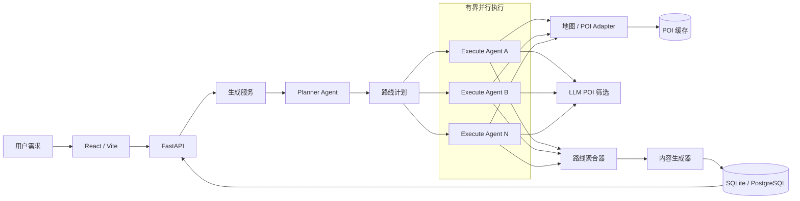
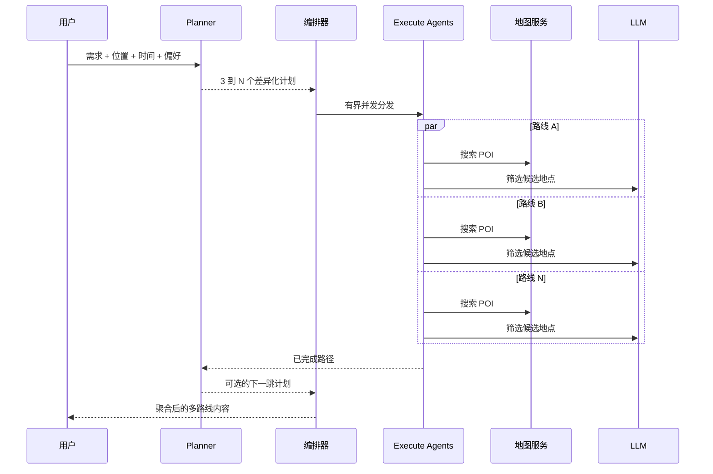

<p align="center">
  
</p>

<h1 align="center">CityCity Agent</h1>

<p align="center"><strong>专注城市玩法规划：用并行多路线 Agent，回答“现在可以玩什么、应该怎么玩”。<br />同时封装为 Agent Skill，让 Cursor、Claude Code、Codex 也能直接帮你规划城市玩法。</strong></p>

<p align="center">
  <a href="README.md">English</a> ·
  <a href="https://shanghaicitycity-web.havenai.online/">在线演示</a> ·
  <a href="https://github.com/lianyixin/citycity-agent">GitHub</a>
</p>

<p align="center">
  <a href="https://shanghaicitycity-web.havenai.online/"></a>
  <a href="https://shanghaicitycity-web.havenai.online/"></a>
  <a href="https://www.xiaohongshu.com/user/profile/62aa83ef000000001b02b574"></a>
  <a href="LICENSE"></a>
</p>

**[上海 City 不 City](https://shanghaicitycity-web.havenai.online/)** 是一个 **AI 驱动的上海城市漫步路线发现平台**。本仓库是支撑它的开源 Agent：用户提出“上海长宁今晚有什么好玩的”，CityCity Agent 会返回**多条有真实地点支撑的玩法路线**。Planner Agent 先生成多样化分支，多个 Execute Agent 再以受控并发的方式搜索 POI、筛选地点并递归扩展路线。

## 📊 当前成绩

截至 **2026 年 8 月 15 日**，线上产品已经有真实用户和真实内容：

| 指标 | 快照 |
| --- | --- |
| **月活跃访客** | **约 1.3k MAU**（近 30 天 1.28k 独立访客） |
| **内容验证** | 小红书账号[「上海 City 不 City」](https://www.xiaohongshu.com/user/profile/62aa83ef000000001b02b574) 已有 **400+ 粉丝**，持续发布 AI 生成的城市玩法笔记 |

<p align="center">
  
</p>

<p align="center"><sub>线上站点 Umami 快照，统计区间为近 30 天，截取于 2026 年 8 月 15 日前。</sub></p>

## 🚀 为什么不一样

> [!IMPORTANT]
> ### 一次提问，多种有真实地点支撑的玩法。
> - ⚡ **先探索，再选择。** Planner 先展开差异化方向，多个 Execute Agent 再受控并发，一次生成多条候选玩法路线。
> - 🏙️ **为城市日常而设计，不做泛化旅行物流。** 聚焦几小时到一天内的 Citywalk、约会、亲子、美食、拍照和夜游，而不是酒店、机票与跨城多日衔接。
> - 📍 **真实地点落地，还能继续扩展。** 每个分支都会搜索地图 POI、筛选合适地点，并递归规划下一站，不停留在泛化建议。

| | 常见的单路线生成流程 | **CityCity Agent** |
| --- | --- | --- |
| **输出结果** | 给出一套方案，不合适就重新生成 | 一次生成多条差异化路线，直接比较选择 |
| **规划范围** | 宽泛的旅行行程生成 | 几小时到一天内的城市玩法规划 |
| **执行方式** | 单链路生成 | Planner → 并行 Execute Agents → POI 验证 → 路线聚合 |

## 🎬 在线演示

**[体验「上海 City 不 City」→](https://shanghaicitycity-web.havenai.online/)**

https://github.com/user-attachments/assets/692651f0-d87b-4a2e-b287-cab1bd7e0bad

**[▶ 下载高清产品演示视频](https://github.com/lianyixin/citycity-agent/releases/download/product-demo/product-demo.mp4)** · [查看 Release](https://github.com/lianyixin/citycity-agent/releases/tag/product-demo)

## 🎯 项目背景

传统地图擅长回答“某家店在哪里”，攻略平台擅长展示“别人去过哪里”，但当用户提出“今晚下班后在上海长宁和朋友玩什么”“周末下午想找一条不累、能拍照的路线”时，仍需要自己完成地点搜索、筛选、排序和路线组合。

CityCity Agent 从自然语言中理解地点、时间、同行人、预算与偏好，先规划多个玩法方向，再调用地图 POI 数据并行验证，最后组织成可直接选择的多路线方案。线上版本以“上海 City 不 City”为产品形态，同时保留向其他城市和地图服务扩展的能力。

## 💬 可以这样问

直接描述“在哪里、什么时候、和谁、偏好什么”，Agent 的结果通常会更准确：

```text
上海长宁今晚有什么适合两个人玩的？

周六下午从静安寺出发，和朋友散步、喝咖啡，想要一条不累的路线

徐家汇附近下班后玩 3 小时，预算 200 元以内，想吃饭加看夜景

雨天在浦东带孩子玩什么？希望室内为主，地点不要太分散

第一次约会去新天地怎么玩？想安静一点，也要适合拍照

住在外滩附近，上午想 Citywalk，中午找一家本帮菜，怎么安排？

杭州西湖周边半天怎么玩？不想只去热门景点
```

> [!NOTE]
> **当前建议规划一天以内的行程。** CityCity Agent 目前更适合几小时、半日或一日内的 Citywalk、约会、亲子、美食、拍照和夜游路线。暂不建议咨询跨天、多城市或包含住宿衔接的旅行计划，因为当前 Agent 还没有酒店、跨城交通和多日状态优化能力。

线上版本聚焦上海。对于高德覆盖的城市，可以修改默认城市、坐标和 API Key；对于海外城市，需要实现 Google Maps、Mapbox 等地图 Provider Adapter，而 Planner/Execute 编排可以继续复用。

## ✨ 项目包含什么

- 可运行的 React/Vite 城市内容流与 AI 玩法规划界面
- FastAPI 生成 API、进度日志、搜索、互动与 ZIP 导出
- Planner Agent、Execute Agent 和多轮路线探索工作流
- 基于 `asyncio` 的有界并行路线执行
- 高德 POI 搜索、地理编码与持久化缓存
- DeepSeek 路线规划、候选 POI 筛选与内容组织
- SQLite 本地开发和 PostgreSQL 生产部署支持
- 可选的 Logto 登录、Umami 分析、支付宝订阅与即梦图片润色
- Docker 部署、示例数据、中英文文档和完整后端测试

## 🧠 工程实现亮点

- **并行多路线探索**：多个路线分支并发执行，而不是串行生成一条路线。
- **Planner / Execute 分离**：LLM 负责规划意图，工具调用负责用真实 POI 落地。
- **递归路线扩展**：已完成分支可继续规划下一站，形成多地点路线。
- **有界并发**：使用 `asyncio.Semaphore` 和 `asyncio.gather` 控制并发及 API 压力。
- **分支故障隔离**：单个分支失败不会丢弃其他成功路线；全部失败时仍会明确报错。
- **结构化存储**：生成请求、日志、路线、POI、帖子和互动均可查询。
- **地图 Provider 边界**：地图能力集中在 `AmapTool`，便于接入其他地图服务。
- **完整全栈示例**：包含 React/Vite、FastAPI、SQLAlchemy，以及可选的认证、分析、支付和图片润色。

## 🧩 Agent Skill：让你的 Agent 也会规划城市玩法

**一个用于城市玩法规划的 Agent Skill：Planner 展开多方向 · Execute 并行分支 ·
真实高德 POI 验证 · 一次给出多条可对比路线。**

驱动线上产品的 Planner / Execute 工作流已封装为独立的
[Agent Skill](skills/citycity-play-planner/SKILL.md)。安装后，你的 Coding Agent 就能直接回答城市玩法问题：
先理解意图，再展开多个差异化玩法方向，并行调用真实高德 POI 数据验证每一站，
把有潜力的分支扩展成多地点路线，最后给出多条可直接比较的玩法路线，
并针对这次玩法亲手写一份可打开、可分享的 HTML 页面（含原始提问、地点图片和站间距离）。
页面样式由 Agent 按玩法气质自行设计：夜游和亲子路线不会长成同一个样子。

该 Skill 遵循开放的 `SKILL.md` 格式，可用于 Cursor、Claude Code、Codex 等兼容 Agent。
它不依赖 CityCity 后端或 DeepSeek；地点验证通过内置脚本调用高德 Web Service API，
因此需要配置 `AMAP_API_KEY`，目前覆盖范围为中国大陆城市。
另外，Agent 无法像网页端那样读取你的设备定位，建议一次性配置默认城市和坐标，
否则每次规划前它都需要先问你在哪。

### 安装与调用

最直接的方式是把仓库链接交给你的 Agent。在 Cursor、Claude Code、Codex 或其他兼容 Agent 中直接说：

```text
帮我安装这个 skill：https://github.com/lianyixin/citycity-agent
它在 skills/citycity-play-planner 目录下。
```

Agent 会克隆仓库并把 Skill 链接到你的 skills 目录。也可以用 skills CLI 或手动安装：

```bash
npx skills add lianyixin/citycity-agent
```

```bash
git clone https://github.com/lianyixin/citycity-agent.git
cd citycity-agent

ln -s "$(pwd)/skills/citycity-play-planner" ~/.claude/skills/citycity-play-planner   # Claude Code
# 或
ln -s "$(pwd)/skills/citycity-play-planner" ~/.codex/skills/citycity-play-planner    # Codex
# 或
ln -s "$(pwd)/skills/citycity-play-planner" ~/.cursor/skills/citycity-play-planner   # Cursor
```

配置高德 Key 以便验证真实地点。与网页版不同，Agent 读不到你的设备定位，
因此建议同时配置默认位置，否则每次都要先问你在哪：

```bash
export AMAP_API_KEY=你的服务端高德Key

# 可选但推荐：默认城市与出发坐标
export DEFAULT_CITY=上海
export DEFAULT_CITY_LAT=31.2304
export DEFAULT_CITY_LNG=121.4737
```

如果 Agent 只在会话启动时索引 Skill，请在安装后重启会话。

然后就可以这样提问：

```text
上海长宁今晚有什么适合两个人玩的？

周六下午从静安寺出发，和朋友散步、喝咖啡，想要一条不累的路线

雨天在浦东带孩子玩什么？希望室内为主，地点不要太分散
```

Skill 包含：

- [`SKILL.md`](skills/citycity-play-planner/SKILL.md)：触发元数据与八步规划流程
- [`scripts/amap_poi.py`](skills/citycity-play-planner/scripts/amap_poi.py)：高德 POI 搜索与地理编码，仅依赖标准库
- [`references/route-quality.md`](skills/citycity-play-planner/references/route-quality.md)：选点、过滤、去重与多样性规则
- [`references/html-page.md`](skills/citycity-play-planner/references/html-page.md)：HTML 页面必须包含什么，以及哪些部分由 Agent 自由设计
- [`references/worked-example.md`](skills/citycity-play-planner/references/worked-example.md)：从需求到最终路线的完整示例

## 🏗️ 技术架构



### 并行 Agent 工作流



`MAX_PARALLEL_ROUTES` 默认是 `4`。代码通过 `asyncio.gather(..., return_exceptions=True)` 保留成功分支，并在所有分支均失败时向上抛出错误。

## 🧰 技术栈

- **前端**：React、TypeScript、Vite
- **后端**：Python、FastAPI、Pydantic
- **Agent 编排**：异步 Planner Agent + 有界并行 Execute Agents
- **LLM**：DeepSeek，可通过客户端边界替换
- **地图**：高德 Web Service API + 持久化响应缓存
- **数据库**：本地 SQLite、生产 PostgreSQL
- **可选集成**：Logto、Umami、支付宝、火山引擎即梦
- **部署**：Docker；线上演示由 [Haven AI](https://havenai.cn/) 和 [EasyLaunch](https://easylaunch.aimos.cloud/) 提供部署支持

## 🚀 快速开始

需要 Python 3.11+、Node.js 20+、高德 Web Service Key 和 DeepSeek API Key。

```bash
git clone https://github.com/lianyixin/citycity-agent.git
cd citycity-agent
cp .env.example .env.development
```

编辑 `.env.development`：

```dotenv
AMAP_API_KEY=你的服务端高德Key
DEEPSEEK_API_KEY=你的DeepSeekKey
```

启动后端：

```bash
python -m venv .venv
source .venv/bin/activate
pip install -r backend/requirements.txt
PYTHONPATH=backend uvicorn app.main:app --app-dir backend --host 0.0.0.0 --port 8001 --reload
```

`DATABASE_URL` 为空时自动使用本地 SQLite。

启动前端：

```bash
cd frontend
npm install
npm run dev
```

打开 <http://localhost:5173>。Vite 会把 `/api` 代理到 <http://localhost:8001>。

可选导入示例内容：

```bash
PYTHONPATH=backend python scripts/import_seed.py
```

## 🌍 切换城市

高德支持的国内城市可以直接配置：

```dotenv
DEFAULT_CITY=杭州
DEFAULT_CITY_LAT=30.2741
DEFAULT_CITY_LNG=120.1551
AMAP_API_KEY=你的高德Key
```

请求中传入的目标区域和坐标优先于默认值。

### 海外城市

海外地图服务的请求和响应结构不同，因此不能只替换 Key。需要实现与 `AmapTool` 能力一致的 Provider Adapter：

```python
async def search_pois(query, location, city, radius, limit): ...
async def suggest_locations(query, location, city, limit): ...
```

例如 Google Maps Adapter 使用 Google Maps API Key，并接入 `PlayDiscoveryWorkflow`；Planner/Execute 的并行编排无需改变。

## ⚙️ 配置与密钥安全

完整模板见 [`.env.example`](.env.example)。

- `AMAP_API_KEY`、`DEEPSEEK_API_KEY` 必须仅保存在服务端环境变量中。
- 所有 `.env.*`（除 `.env.example`）均已被 `.gitignore` 排除。
- 如需导出自有 CDN 图片，可通过 `EXTRA_IMAGE_HOSTS` 增加逗号分隔的公共图片域名。
- `VITE_*` 会进入浏览器产物，只能放公开配置，绝不能放密钥。
- 如果密钥被误提交到 Git，仅删除文件不够，必须立刻轮换该密钥。

## ✅ 测试

```bash
PYTHONPATH=backend python -m pytest backend/tests -v
cd frontend && npm run build
```

## 🐳 Docker

```bash
cd frontend && npm ci && npm run build && cd ..
docker build -t citycity-agent .
docker run --rm -p 8001:8000 --env-file .env.production citycity-agent
```

`.env.production` 应由部署平台注入，不能提交到 Git。

本项目**不包含**每天自动发内容的定时调度器；只有用户或 API 明确发起请求时才会生成内容。

## ⚠️ 当前不足

CityCity Agent 目前是可运行的 Agent 应用与工程参考，但距离稳定、可信的通用城市规划器仍有明显差距：

### Agent 与编排

- **Planner 能力有限**：目前主要依赖提示词生成初始方案和下一跳，缺少显式约束求解、反思、回溯和全局路线优化。
- **并行范围有限**：Execute Agent 的活跃路线分支会并行执行，但递归 Planner 仍按节点顺序规划；整个工作流也仍运行在单个 FastAPI 进程内。
- **搜索深度固定**：轮数、分支数和路线深度受固定上限控制，复杂需求可能探索不足，简单需求又可能产生不必要调用。
- **状态与容错较弱**：没有分布式任务队列、持久化 checkpoint、任务恢复和跨进程调度；服务中断后无法从某个 Agent 节点继续。
- **结构化输出仍可能失败**：Planner 和内容生成依赖 LLM 返回 JSON，虽然有解析和兜底逻辑，但复杂输入仍可能出现格式错误或语义漂移。

### POI 与路线质量

- **POI 选择信号不足**：当前主要根据高德候选、评分、距离、图片完整度和 LLM 判断选点，缺少收藏量、评论量、近期热度、排队情况以及真实用户偏好。
- **热点发现不足**：未来可在遵守平台条款和数据授权的前提下，引入小红书等内容平台的点赞、收藏与讨论热度，先发现用户真正喜欢的热点 POI，再围绕热点设计玩法。
- **路线计算较粗**：当前更多使用坐标和直线距离理解地点关系，没有真正接入步行、驾车和公共交通耗时，也没有求解最佳访问顺序。
- **营业状态可能过期**：地图数据或 LLM 可能选到暂停营业、临时闭馆、不适合当前时段的地点，尚缺少实时营业时间和多源交叉验证。
- **约束覆盖不完整**：预算、天气、无障碍、儿童友好、宠物友好、排队时间、预约要求等条件尚未成为强约束。
- **结果排序缺少个性化**：当前没有长期用户画像、历史反馈学习或多人偏好协商，同一个 Query 对不同用户的结果差异有限。

### 内容、图片与体验

- **图片质量不稳定**：图片主要来自地图 POI 返回结果，可能清晰度不足、构图不佳、重复、过期或与推荐玩法不完全一致。
- **缺少图片质量排序**：尚未加入去重、清晰度检测、审美评分、OCR 水印检测、主体匹配和版权/许可校验；即梦润色也只是可选能力。
- **内容真实性仍需核验**：LLM 可能把候选信息组织成听起来合理但不够准确的描述，发布前仍应人工检查地点、价格、营业时间和交通信息。
- **等待时间较长**：一次完整生成会产生多次地图和 LLM 调用；本地真实测试约需两分钟，暂未做到流式展示每个并行分支。
- **当前只适合单日玩法**：尚未支持酒店、跨城交通、行李、每日起终点和多日节奏等旅行规划问题。
- **国际化尚未完成**：目前内置的是高德和中文 Prompt；海外城市还需要地图 Adapter、语言本地化、时区、货币和地址格式支持。
- **缺少系统评测**：尚未建立针对 POI 真实性、路线可达性、多样性、用户满意度、延迟和成本的标准数据集与自动评测。

## 🗺️ Roadmap

- 并行递归 Planner、可恢复工作流与持久化 Agent checkpoint
- 基于交通时间、营业时间、预算和天气的约束路线优化
- 在合规数据源上构建 POI 热度与用户喜爱度排序
- Google Maps、Mapbox 等地图 Provider Adapter
- 图片去重、质量评分、内容匹配与版权状态检查
- 用户反馈闭环与个性化路线排序
- 前端实时展示并行分支、工具调用和阶段性结果
- 路线真实性、多样性、可达性、延迟与成本评测集
- 多语言 Prompt、本地化配置及海外城市支持
- 多日行程、住宿和跨城交通规划

## 🙏 致谢

特别感谢 **[Haven AI](https://havenai.cn/)** 和 **[EasyLaunch](https://easylaunch.aimos.cloud/)**，帮助本项目从 Agent 构建的应用实现一键部署上线。

## 🤝 参与贡献

欢迎提交 Issue 和 Pull Request，详见 [CONTRIBUTING.md](CONTRIBUTING.md)。安全问题请参阅 [SECURITY.md](SECURITY.md)。

## 📄 License

[MIT](LICENSE) © 2026 [Ethan Lian](https://github.com/lianyixin)
